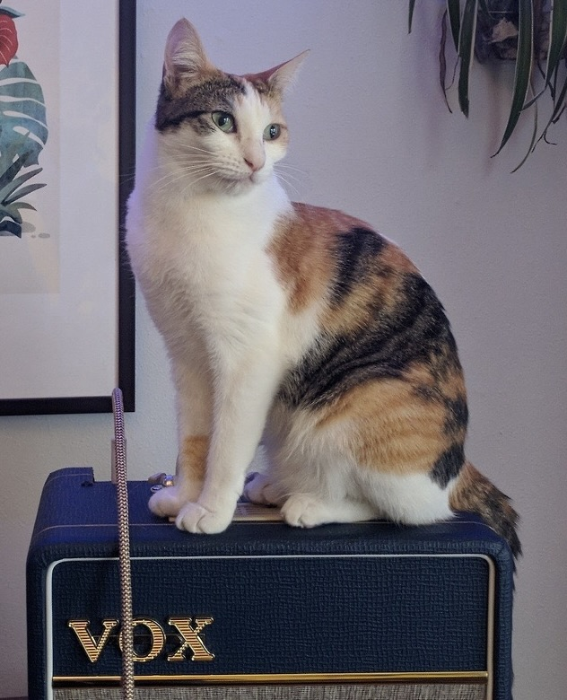

CALICO
------

Cli for Armbian Linux Image COnfiguration

Version
-------

1.4.9

Introduction
------------

Calico is a CLI for Armbian Linux Image Configuration.
It is a wrapper around the Armbian build system making preconfiguration of images easier.

Where possible the script will use sensible defaults to configure the image.
If there are not enough defaults, or the manual option is used for compile,
the armbian build system menu interface will be launched.

The script can be used to modify existing images as well as create new images.

License
-------

CC BY-SA: https://creativecommons.org/licenses/by-sa/4.0/

Fund me here: https://ko-fi.com/richardatlateralblast

Goals
-----

The goals of this script are to:

Provide a command line processor that:

- Can automate the configuration of network and other settings in Armbian images.
- Can build Armbian images.
- Can modify existing Armbian images.

Status
------

I was unable to get consistent results using the method of setting
evironment variables in /root/.not_logged_in_yet, as such the script
uses the /root/provisioning.sh method. This allows for more consistent
results, and more control over the configuration process.

Current provisioning script features include:
- Create user account
- Set user password
- Set root password
- Set user group
- Set user group ID
- Set user shell
- Create user home directory
- Install user SSH keys
- Set hostname
- Set timezone
- Set locale
- Set real name
- Set netmask
- Set gateway
- Set DNS
- Set locale

The script works on both Linux and MacOS.
On Linux it uses the native tools to mount and modify the image.
On MacOS it uses Docker to mount and modify the image.

Requirements
------------

- Armbian build system
- Docker
- qemu-system-arm
- qemu-system-riscv
- binfmt-support
- qemu-user-binfmt
- ipcalc

Usage
-----

Help:

```bash
./calico.sh --help
```

Options:

```bash
./calico.sh --usage options
```
Version:

```bash
./calico.sh --version
```

Examples
--------

List boards:

```bash
./calico.sh --list boards
```

List images:

```bash
./calico.sh --list images
```

List images with full path:

```bash
./calico.sh --list images --full
```

Manual compile:

```bash
./calico.sh --complile --manual
```

Configure compile for orangepipc board:

```bash
./calico.sh --compile --board orangepipc
```

Modify existing image's IP, gateway, DNS, etc:

```bash
./calico.sh --modify --image /path/to/image.img --ip 192.168.1.100 --gateway 192.168.1.1 --dns 8.8.8.8 --netmask 255.255.255.0
```

Mount image:

```bash
./calico.sh --mount --image /path/to/image.img
```

Unmount image:

```bash
./calico.sh --unmount --image /path/to/image.img
```

Generate runtime configuration:

```bash
./calico.sh --generate --type runtime
```

Generate buildtime configuration:

```bash
./calico.sh --generate --type buildtime
```

Generate docker script:

```bash
./calico.sh --generate --type docker
```

Notes
-----

An example of manually mounting an image on Linux:

```bash
sudo losetup -P /dev/lopp0 -f /path/to/image.img
sudo mount /dev/loop0p1 /mnt
```

An example of manually mounting an image on MacOS:

```bash
docker run --privileged -v /path/to/image:/mnt/image -it ubuntu:latest bash
mkdir /mnt/imagefs
export IMAGE=/path/to/image.img
export LOOPDEV=$(losetup --partscan --find --show "$IMAGE")
lsblk --raw --output "NAME,MAJ:MIN" --noheadings $LOOPDEV | tail -n +2 | while read dev node;
do
    MAJ=$(echo $node | cut -d: -f1)
    MIN=$(echo $node | cut -d: -f2)
    [ ! -e "/dev/$dev" ] &&  mknod "/dev/$dev" b $MAJ $MIN
done
mount ${LOOPDEV}p1 /mnt/imagefs
```
